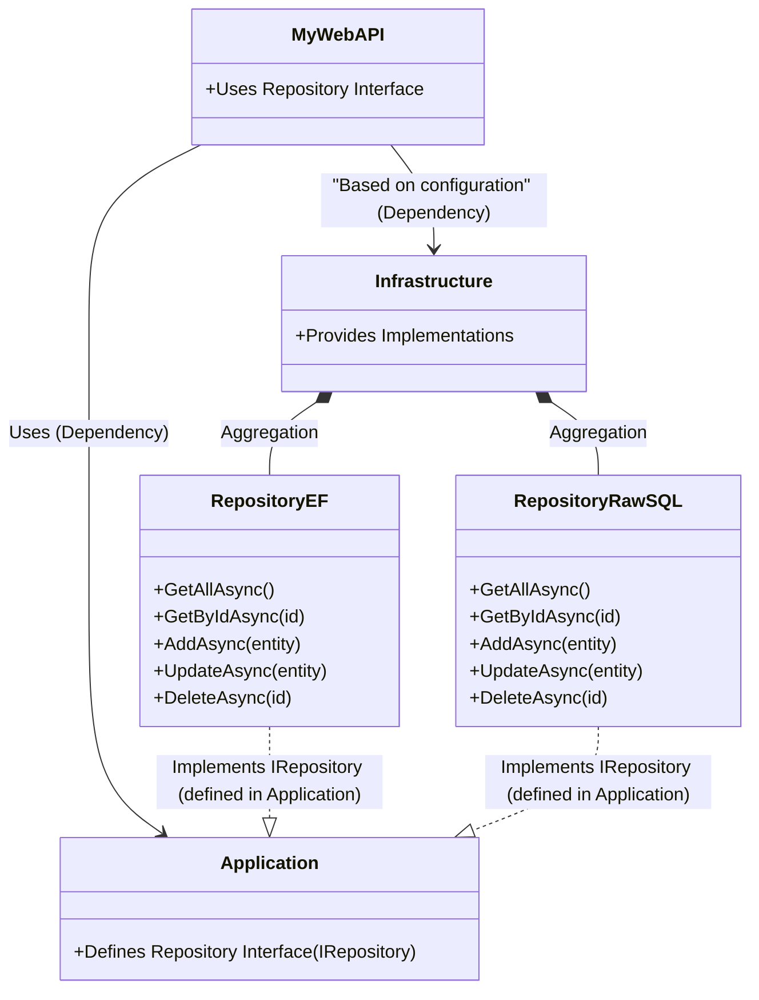

Below is a complete guide (targeting .NET 9) that uses SQL Server. In this guide, we use a Docker image for SQL Server and update the repository implementations to work with SQL Server (using EF Core with SQL Server and a raw SQL version using ADO.NET with Microsoft.Data.SqlClient). The guide also shows how to install Swagger via Swashbuckle and how the repository is used in a sample controller.

---

# Complete Guide: Building a .NET 9 Web API Using SQL Server (via Docker) and the IRepository Pattern

---

## **Step 0: Create an Empty Solution in Visual Studio**
sadfasdfadsfs
1. **Open Visual Studio 2022 (or later).**
2. **Create a new project:**
   - Go to **File > New > Project**.
   - Select the **"Blank Solution"** template.
   - Name the solution **MySolution** and choose your location.
3. Click **Create**.

---

## **Step 1: Create the Projects**

### **1. Create the Web API Project (MyWebAPI)**

- **Project Type:** ASP.NET Core Web API  
- **Target Framework:** .NET 9  
- **Steps:**
  1. In **Solution Explorer**, right-click the solution and choose **Add > New Project**.
  2. Select the **"ASP.NET Core Web API"** template.
  3. Name the project **MyWebAPI**.
  4. In the project configuration, select **.NET 9** as the target framework and click **Create**.
  5. If the template uses minimal APIs (top-level statements), modify it to use controllers:
     - In **Program.cs**, remove any minimal endpoint mappings (e.g., `app.MapGet(...)`) and add:
       ```csharp
       builder.Services.AddControllers();
       // ...
       app.MapControllers();
       ```
     - Create a new folder **Controllers** and add your controller classes there.

### **2. Create the Application Class Library**

- **Project Type:** Class Library  
- **Target Framework:** .NET 9  
- **Steps:**
  1. Right-click the solution and choose **Add > New Project**.
  2. Select the **"Class Library"** template.
  3. Name the project **Application**.
  4. Ensure the target framework is set to **.NET 9** and click **Create**.

### **3. Create the Infrastructure Class Library**

- **Project Type:** Class Library  
- **Target Framework:** .NET 9  
- **Steps:**
  1. Right-click the solution and choose **Add > New Project**.
  2. Select the **"Class Library"** template.
  3. Name the project **Infrastructure**.
  4. Ensure the target framework is set to **.NET 9** and click **Create**.

### **4. Set Up Project References**

- In **Solution Explorer**, right-click the **MyWebAPI** project and choose **Add > Reference...**.
  - Check both **Application** and **Infrastructure** projects, then click **OK**.
- In the **Infrastructure** project, add a reference to **Application**:
  - Right-click **Infrastructure**, choose **Add > Reference...**, and select **Application**.

---

## **Step 2: Install Required NuGet Packages**

### **For MyWebAPI:**

1. Right-click the **MyWebAPI** project and choose **Manage NuGet Packages**.
2. Install the following packages:
   - **Microsoft.EntityFrameworkCore**
   - **Microsoft.EntityFrameworkCore.SqlServer**  
     *(Using SQL Server instead of SQLite.)*
   - **Microsoft.EntityFrameworkCore.Design**
   - **Microsoft.EntityFrameworkCore.Tools**
   - **Swashbuckle.AspNetCore**  
     *(Enables Swagger generation via AddSwaggerGen()).*

### **For Infrastructure (Raw SQL Implementation):**

1. Right-click the **Infrastructure** project and choose **Manage NuGet Packages**.
2. Install the package:
   - **Microsoft.Data.SqlClient**  
     *(This package is required for using SqlConnection and SqlCommand in the raw SQL repository.)*

---

## **Step 3: Set Up SQL Server via Docker**

Before running your API, ensure that SQL Server is available. You can run SQL Server in Docker using the following command in your terminal (adjust the password as needed):

```bash
docker run -e "ACCEPT_EULA=Y" -e "SA_PASSWORD=YourStrong@Passw0rd" -p 1433:1433 --name sqlserver -d mcr.microsoft.com/mssql/server:2019-latest
```

This command will pull and run the SQL Server 2019 image with SQL Server running on port 1433. Make sure to use a strong SA password.

---

## **Step 4: Configure SQL Server (EF Core Implementation)**

### **4.1 Create the Database Context**

- **Project:** Infrastructure  
- **Folder:** Create a new folder named **Data**.  
- **File:** Add a new class called **ApplicationDbContext.cs** with the following code:

```csharp
using Microsoft.EntityFrameworkCore;

namespace Infrastructure.Data
{
    public class ApplicationDbContext : DbContext
    {
        public ApplicationDbContext(DbContextOptions<ApplicationDbContext> options)
            : base(options) { }

        public DbSet<Product> Products { get; set; }
    }

    // A simple Product entity
    public class Product
    {
        public int Id { get; set; }
        public string Name { get; set; } = string.Empty;
        public decimal Price { get; set; }
    }
}
```

---

## **Step 5: Define the Repository Interface**

- **Project:** Application  
- **Folder:** Create a new folder called **Interfaces**.  
- **File:** Add a new class called **IRepository.cs** with the following code:

```csharp
using System.Collections.Generic;
using System.Threading.Tasks;

namespace Application.Interfaces
{
    public interface IRepository<T> where T : class
    {
        Task<IEnumerable<T>> GetAllAsync();
        Task<T?> GetByIdAsync(int id);
        Task AddAsync(T entity);
        Task UpdateAsync(T entity);
        Task DeleteAsync(int id);
    }
}
```

---

## **Step 6: Implement the Entity Framework Repository**

- **Project:** Infrastructure  
- **Folder:** Create a new folder called **Repositories**.  
- **File:** Add a new class called **RepositoryEF.cs** with the following code:

```csharp
using Application.Interfaces;
using Infrastructure.Data;
using Microsoft.EntityFrameworkCore;

namespace Infrastructure.Repositories
{
    public class RepositoryEF<T> : IRepository<T> where T : class
    {
        private readonly ApplicationDbContext _context;
        private readonly DbSet<T> _dbSet;

        public RepositoryEF(ApplicationDbContext context)
        {
            _context = context;
            _dbSet = _context.Set<T>();
        }

        public async Task<IEnumerable<T>> GetAllAsync()
        {
            return await _dbSet.ToListAsync();
        }

        public async Task<T?> GetByIdAsync(int id)
        {
            return await _dbSet.FindAsync(id);
        }

        public async Task AddAsync(T entity)
        {
            await _dbSet.AddAsync(entity);
            await _context.SaveChangesAsync();
        }

        public async Task UpdateAsync(T entity)
        {
            _dbSet.Update(entity);
            await _context.SaveChangesAsync();
        }

        public async Task DeleteAsync(int id)
        {
            var entity = await _dbSet.FindAsync(id);
            if (entity != null)
            {
                _dbSet.Remove(entity);
                await _context.SaveChangesAsync();
            }
        }
    }
}
```

---

## **Step 7: Implement the Raw SQL Repository (No DbContext)**

- **Project:** Infrastructure  
- **Folder:** In the **Repositories** folder, add a new class called **RepositoryRawSQL.cs** with the following code:

```csharp
// Note: This implementation requires the Microsoft.Data.SqlClient NuGet package.
// Ensure you install it in the Infrastructure project via the NuGet Package Manager or:
// Install-Package Microsoft.Data.SqlClient

using Application.Interfaces;
using Microsoft.Data.SqlClient;
using Microsoft.Extensions.Configuration;
using System;
using System.Collections.Generic;
using System.Linq;
using System.Text.Json;
using System.Threading.Tasks;

namespace Infrastructure.Repositories
{
    public class RepositoryRawSQL<T> : IRepository<T> where T : class
    {
        private readonly string _connectionString;

        // Accept IConfiguration to automatically retrieve the connection string from appsettings.json
        public RepositoryRawSQL(IConfiguration configuration)
        {
            _connectionString = configuration.GetConnectionString("DefaultConnection");
        }

        private SqlConnection GetConnection()
        {
            return new SqlConnection(_connectionString);
        }

        // Helper: Convert a DataReader row to a Dictionary<string, object?>
        private Dictionary<string, object?> ReadRow(SqlDataReader reader)
        {
            var dict = new Dictionary<string, object?>();
            for (int i = 0; i < reader.FieldCount; i++)
            {
                dict[reader.GetName(i)] = reader.IsDBNull(i) ? null : reader.GetValue(i);
            }
            return dict;
        }

        public async Task<IEnumerable<T>> GetAllAsync()
        {
            var result = new List<T>();
            using var connection = GetConnection();
            await connection.OpenAsync();
            var tableName = typeof(T).Name + "s"; // basic pluralization
            var command = new SqlCommand($"SELECT * FROM {tableName}", connection);
            using var reader = await command.ExecuteReaderAsync();
            while (await reader.ReadAsync())
            {
                var rowDict = ReadRow(reader);
                var json = JsonSerializer.Serialize(rowDict);
                var entity = JsonSerializer.Deserialize<T>(json);
                if (entity != null)
                    result.Add(entity);
            }
            return result;
        }

        public async Task<T?> GetByIdAsync(int id)
        {
            using var connection = GetConnection();
            await connection.OpenAsync();
            var tableName = typeof(T).Name + "s";
            var command = new SqlCommand($"SELECT * FROM {tableName} WHERE Id = @id", connection);
            command.Parameters.AddWithValue("@id", id);
            using var reader = await command.ExecuteReaderAsync();
            if (await reader.ReadAsync())
            {
                var rowDict = ReadRow(reader);
                var json = JsonSerializer.Serialize(rowDict);
                return JsonSerializer.Deserialize<T>(json);
            }
            return null;
        }

        public async Task AddAsync(T entity)
        {
            using var connection = GetConnection();
            await connection.OpenAsync();
            var tableName = typeof(T).Name + "s";

            var props = typeof(T).GetProperties().Where(p => p.Name != "Id").ToList();
            var columns = string.Join(", ", props.Select(p => p.Name));
            var parameters = string.Join(", ", props.Select(p => "@" + p.Name));

            var command = new SqlCommand($"INSERT INTO {tableName} ({columns}) VALUES ({parameters})", connection);
            foreach (var prop in props)
            {
                command.Parameters.AddWithValue("@" + prop.Name, prop.GetValue(entity) ?? DBNull.Value);
            }
            await command.ExecuteNonQueryAsync();
        }

        public async Task UpdateAsync(T entity)
        {
            using var connection = GetConnection();
            await connection.OpenAsync();
            var tableName = typeof(T).Name + "s";
            var idProp = typeof(T).GetProperty("Id");
            if (idProp == null)
                throw new Exception("Entity must have an Id property.");

            var idValue = idProp.GetValue(entity);
            if (idValue == null)
                throw new Exception("Id value cannot be null.");

            var props = typeof(T).GetProperties().Where(p => p.Name != "Id").ToList();
            var setClause = string.Join(", ", props.Select(p => $"{p.Name} = @{p.Name}"));

            var command = new SqlCommand($"UPDATE {tableName} SET {setClause} WHERE Id = @Id", connection);
            command.Parameters.AddWithValue("@Id", idValue);
            foreach (var prop in props)
            {
                command.Parameters.AddWithValue("@" + prop.Name, prop.GetValue(entity) ?? DBNull.Value);
            }
            await command.ExecuteNonQueryAsync();
        }

        public async Task DeleteAsync(int id)
        {
            using var connection = GetConnection();
            await connection.OpenAsync();
            var tableName = typeof(T).Name + "s";
            var command = new SqlCommand($"DELETE FROM {tableName} WHERE Id = @id", connection);
            command.Parameters.AddWithValue("@id", id);
            await command.ExecuteNonQueryAsync();
        }
    }
}
```

*This file is part of the **Infrastructure** project. The comment at the top reminds you to install the Microsoft.Data.SqlClient NuGet package in the Infrastructure project.*

---

## **Step 8: Configure Application Settings**

- **Project:** MyWebAPI  
- **File:** Open **appsettings.json** and update it with the following content:

```json
{
  "ConnectionStrings": {
    "DefaultConnection": "Server=localhost,1433;Database=MyDatabase;User Id=sa;Password=YourStrong@Passw0rd;TrustServerCertificate=True"
  },
  "UseRawSQL": true,
  "Logging": {
    "LogLevel": {
      "Default": "Information",
      "Microsoft.AspNetCore": "Warning"
    }
  },
  "AllowedHosts": "*"
}
```

*Make sure the connection string matches the settings of your SQL Server Docker image (adjust the SA password if necessary).*

---

## **Step 9: Configure Dependency Injection in MyWebAPI**

- **Project:** MyWebAPI  
- **File:** Open **Program.cs** and modify it as follows:

```csharp
using Application.Interfaces;
using Infrastructure.Data;
using Infrastructure.Repositories;
using Microsoft.EntityFrameworkCore;

var builder = WebApplication.CreateBuilder(args);

// Retrieve connection string and flag from configuration
var connectionString = builder.Configuration.GetConnectionString("DefaultConnection");
bool useRawSQL = builder.Configuration.GetValue<bool>("UseRawSQL");

if (!useRawSQL)
{
    // Register EF DbContext when not using raw SQL
    builder.Services.AddDbContext<ApplicationDbContext>(options =>
        options.UseSqlServer(connectionString));
}

// Register repository based on configuration flag
if (useRawSQL)
{
    // For raw SQL, register RepositoryRawSQL as an open generic type.
    // Its constructor will receive IConfiguration automatically.
    builder.Services.AddScoped(typeof(IRepository<>), typeof(RepositoryRawSQL<>));
}
else
{
    builder.Services.AddScoped(typeof(IRepository<>), typeof(RepositoryEF<>));
}

builder.Services.AddControllers();
builder.Services.AddEndpointsApiExplorer();
builder.Services.AddSwaggerGen(); // Swashbuckle.AspNetCore enables AddSwaggerGen()

var app = builder.Build();

if (app.Environment.IsDevelopment())
{
    app.UseSwagger();
    app.UseSwaggerUI();
}

app.UseAuthorization();
app.MapControllers();
app.Run();
```

*Note: When not using raw SQL, the EF Core repository uses SQL Server via `UseSqlServer(connectionString)`.*

---

## **Step 10: Create a Sample Controller**

- **Project:** MyWebAPI  
- **Folder:** Create a new folder named **Controllers**.  
- **File:** Add a new controller class called **ProductController.cs** with the following code:

```csharp
using Application.Interfaces;
using Infrastructure.Data; // Only to access the Product model
using Microsoft.AspNetCore.Mvc;

namespace MyWebAPI.Controllers
{
    [Route("api/[controller]")]
    [ApiController]
    public class ProductController : ControllerBase
    {
        private readonly IRepository<Product> _repository;

        public ProductController(IRepository<Product> repository)
        {
            _repository = repository;
        }

        [HttpGet]
        public async Task<IActionResult> GetAll()
        {
            var products = await _repository.GetAllAsync();
            return Ok(products);
        }

        [HttpGet("{id}")]
        public async Task<IActionResult> GetById(int id)
        {
            var product = await _repository.GetByIdAsync(id);
            if (product == null)
                return NotFound();
            return Ok(product);
        }

        [HttpPost]
        public async Task<IActionResult> Create(Product product)
        {
            await _repository.AddAsync(product);
            return CreatedAtAction(nameof(GetById), new { id = product.Id }, product);
        }

        [HttpPut("{id}")]
        public async Task<IActionResult> Update(int id, Product product)
        {
            if (id != product.Id)
                return BadRequest("Mismatched product ID.");
            await _repository.UpdateAsync(product);
            return NoContent();
        }

        [HttpDelete("{id}")]
        public async Task<IActionResult> Delete(int id)
        {
            var existing = await _repository.GetByIdAsync(id);
            if (existing == null)
                return NotFound();
            await _repository.DeleteAsync(id);
            return NoContent();
        }
    }
}
```

*This controller demonstrates how MyWebAPI uses the repository interface (defined in Application). The concrete implementation (EF Core or raw SQL) is injected based on the configuration.*

---

## **Step 11: Run and Test the API**

1. Press **F5** or click **Start Debugging** in Visual Studio to run the project.
2. Open your browser and navigate to the URL provided (for example, `https://localhost:5001/swagger`) to test the endpoints via the Swagger UI.

---

## **Summary**

- **Solution Setup:**  
  You created an empty solution in Visual Studio and added three projects:
  - **MyWebAPI:** The API layer (targeting .NET 9).
  - **Application:** Contains business logic and interfaces.
  - **Infrastructure:** Contains data access implementations (RepositoryEF and RepositoryRawSQL).

- **Data Access Implementations:**  
  - **RepositoryEF:** Uses EF Core with a DbContext and SQL Server.
  - **RepositoryRawSQL:** Uses pure ADO.NET with SQL Server (no DbContext).  
    *Note: RepositoryRawSQL requires the Microsoft.Data.SqlClient NuGet package, which is installed in the Infrastructure project.*

- **SQL Server via Docker:**  
  You can run SQL Server using a Docker image:
  ```bash
  docker run -e "ACCEPT_EULA=Y" -e "SA_PASSWORD=YourStrong@Passw0rd" -p 1433:1433 --name sqlserver -d mcr.microsoft.com/mssql/server:2019-latest
  ```
- **Swagger:**  
  The **Swashbuckle.AspNetCore** package is installed in MyWebAPI so that `AddSwaggerGen()` works properly.

- **Configuration Toggle:**  
  In **appsettings.json**, the `"UseRawSQL"` setting determines which repository implementation is used.

- **Dependency Injection:**  
  MyWebAPI registers dependencies based on configuration, and controllers use the repository interface defined in the Application layer.

---

## **Architecture Overview (Mermaid Diagram)**



### **Diagram Explanation:**

- **MyWebAPI (Presentation Layer):**  
  Uses the repository interface defined in **Application** and calls into **Infrastructure** based on configuration.

- **Application (Business Layer):**  
  Defines the repository interface (IRepository) that both repository implementations follow.

- **Infrastructure (Data Access Layer):**  
  Provides two implementations:
  - **RepositoryEF:** Uses EF Core with SQL Server.
  - **RepositoryRawSQL:** Uses raw SQL (ADO.NET with Microsoft.Data.SqlClient).  
  Both are aggregated within Infrastructure and implement the interface defined in Application.

This updated guide and diagram provide a complete Visual Studio–based approach to building a .NET 9 Web API using SQL Server (via Docker) and the IRepository pattern—with both EF Core and raw SQL implementations, Swagger support, and all necessary NuGet package installations.
