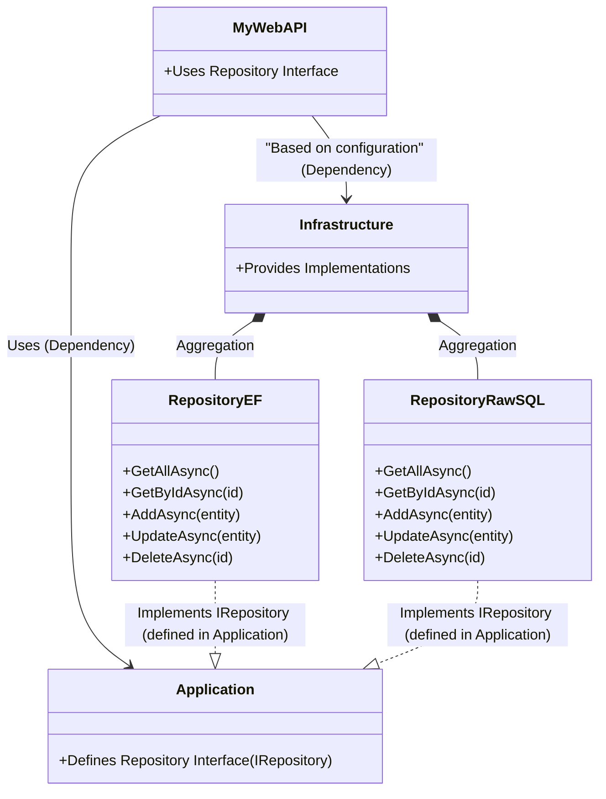

Below is a complete, step‐by‐step guide to create an empty solution, then build a .NET Web API using SQLite and the IRepository pattern—with two implementations: one using Entity Framework Core (EF) and one using raw SQL (using ADO.NET without DbContext). You can toggle between them with a configuration flag.

---

## **Step 0: Create an Empty Solution**

1. Open a terminal in your working folder.
2. Create an empty solution:
   ```sh
   dotnet new sln -n MySolution
   ```

---

## **Step 1: Install Prerequisites**

1. **.NET SDK**  
   Download and install the latest .NET SDK (e.g., .NET 9) from [Microsoft .NET](https://dotnet.microsoft.com/download/dotnet).  
   Verify installation:
   ```sh
   dotnet --version
   ```

2. **Visual Studio Code**  
   Download and install [VS Code](https://code.visualstudio.com/).

3. **C# Extension**  
   In VS Code, open Extensions (`Ctrl+Shift+X`), search for **"C#"**, and install the official extension.

4. **Entity Framework Core CLI**  
   Install the EF Core CLI tools:
   ```sh
   dotnet tool install --global dotnet-ef
   ```
   Verify with:
   ```sh
   dotnet ef --version
   ```

---

## **Step 2: Create Projects and Set Up the Architecture**

We’ll create three projects:
- **MyWebAPI** (API layer)
- **Application** (Business logic and interfaces)
- **Infrastructure** (Data access with two repository implementations)

Run the following commands from the solution folder:

1. **Create the Web API Project:**
   ```sh
   dotnet new webapi -n MyWebAPI
   ```

2. **Create the Application Class Library:**
   ```sh
   dotnet new classlib -n Application
   ```

3. **Create the Infrastructure Class Library:**
   ```sh
   dotnet new classlib -n Infrastructure
   ```

4. **Add Projects to the Solution:**
   ```sh
   dotnet sln MySolution.sln add MyWebAPI/MyWebAPI.csproj
   dotnet sln MySolution.sln add Application/Application.csproj
   dotnet sln MySolution.sln add Infrastructure/Infrastructure.csproj
   ```

5. **Add Project References (API depends on both Application & Infrastructure):**
   ```sh
   dotnet add MyWebAPI/MyWebAPI.csproj reference Application/Application.csproj
   dotnet add MyWebAPI/MyWebAPI.csproj reference Infrastructure/Infrastructure.csproj
   ```

Your folder structure should now resemble:
```
MySolution.sln
├── MyWebAPI/          (API project)
├── Application/       (Business logic & interfaces)
└── Infrastructure/    (Data access)
```

Open the solution in VS Code:
```sh
code .
```

---

## **Step 3: Install Required NuGet Packages**

In the **MyWebAPI** project, add the following packages:

```sh
dotnet add MyWebAPI package Microsoft.EntityFrameworkCore
dotnet add MyWebAPI package Microsoft.EntityFrameworkCore.Sqlite
dotnet add MyWebAPI package Microsoft.EntityFrameworkCore.Design
dotnet add MyWebAPI package Microsoft.EntityFrameworkCore.Tools
```

For raw SQL access, we’ll use ADO.NET with the `Microsoft.Data.Sqlite` package (installed as part of the EF SQLite package).

---

## **Step 4: Configure SQLite**

### **4.1 Create the Database Context (for EF Implementation)**
Inside the **Infrastructure** project, create a folder named `Data` and add `ApplicationDbContext.cs`:

```csharp
// Infrastructure/Data/ApplicationDbContext.cs
using Microsoft.EntityFrameworkCore;

namespace Infrastructure.Data
{
    public class ApplicationDbContext : DbContext
    {
        public ApplicationDbContext(DbContextOptions<ApplicationDbContext> options)
            : base(options) { }

        public DbSet<Product> Products { get; set; }
    }

    // A simple Product entity
    public class Product
    {
        public int Id { get; set; }
        public string Name { get; set; } = string.Empty;
        public decimal Price { get; set; }
    }
}
```

---

## **Step 5: Define the IRepository Interface**

Inside the **Application** project, create a folder called `Interfaces` and add `IRepository.cs`:

```csharp
// Application/Interfaces/IRepository.cs
using System.Collections.Generic;
using System.Threading.Tasks;

namespace Application.Interfaces
{
    public interface IRepository<T> where T : class
    {
        Task<IEnumerable<T>> GetAllAsync();
        Task<T?> GetByIdAsync(int id);
        Task AddAsync(T entity);
        Task UpdateAsync(T entity);
        Task DeleteAsync(int id);
    }
}
```

---

## **Step 6: Implement the Entity Framework Repository**

Inside the **Infrastructure** project, create a folder named `Repositories` and add `RepositoryEF.cs`:

```csharp
// Infrastructure/Repositories/RepositoryEF.cs
using Application.Interfaces;
using Infrastructure.Data;
using Microsoft.EntityFrameworkCore;

namespace Infrastructure.Repositories
{
    public class RepositoryEF<T> : IRepository<T> where T : class
    {
        private readonly ApplicationDbContext _context;
        private readonly DbSet<T> _dbSet;

        public RepositoryEF(ApplicationDbContext context)
        {
            _context = context;
            _dbSet = _context.Set<T>();
        }

        public async Task<IEnumerable<T>> GetAllAsync()
        {
            return await _dbSet.ToListAsync();
        }

        public async Task<T?> GetByIdAsync(int id)
        {
            return await _dbSet.FindAsync(id);
        }

        public async Task AddAsync(T entity)
        {
            await _dbSet.AddAsync(entity);
            await _context.SaveChangesAsync();
        }

        public async Task UpdateAsync(T entity)
        {
            _dbSet.Update(entity);
            await _context.SaveChangesAsync();
        }

        public async Task DeleteAsync(int id)
        {
            var entity = await _dbSet.FindAsync(id);
            if (entity != null)
            {
                _dbSet.Remove(entity);
                await _context.SaveChangesAsync();
            }
        }
    }
}
```

---

## **Step 7: Implement the Raw SQL Repository (No DbContext)**

Inside **Infrastructure/Repositories**, add `RepositoryRawSQL.cs`. This version uses ADO.NET directly with SQLite, without any dependency on DbContext.

```csharp
// Infrastructure/Repositories/RepositoryRawSQL.cs
using Application.Interfaces;
using Microsoft.Data.Sqlite;
using System;
using System.Collections.Generic;
using System.Threading.Tasks;
using System.Text.Json;
using System.Linq;

namespace Infrastructure.Repositories
{
    public class RepositoryRawSQL<T> : IRepository<T> where T : class
    {
        private readonly string _connectionString;

        public RepositoryRawSQL(string connectionString)
        {
            _connectionString = connectionString;
        }

        private SqliteConnection GetConnection()
        {
            return new SqliteConnection(_connectionString);
        }

        // Helper: Convert a DataReader row to a Dictionary<string, object?>
        private Dictionary<string, object?> ReadRow(SqliteDataReader reader)
        {
            var dict = new Dictionary<string, object?>();
            for (int i = 0; i < reader.FieldCount; i++)
            {
                dict[reader.GetName(i)] = reader.IsDBNull(i) ? null : reader.GetValue(i);
            }
            return dict;
        }

        public async Task<IEnumerable<T>> GetAllAsync()
        {
            var result = new List<T>();
            using var connection = GetConnection();
            await connection.OpenAsync();
            var tableName = typeof(T).Name + "s"; // basic pluralization
            var command = new SqliteCommand($"SELECT * FROM {tableName}", connection);
            using var reader = await command.ExecuteReaderAsync();
            while (await reader.ReadAsync())
            {
                var rowDict = ReadRow(reader);
                var json = JsonSerializer.Serialize(rowDict);
                var entity = JsonSerializer.Deserialize<T>(json);
                if (entity != null)
                    result.Add(entity);
            }
            return result;
        }

        public async Task<T?> GetByIdAsync(int id)
        {
            using var connection = GetConnection();
            await connection.OpenAsync();
            var tableName = typeof(T).Name + "s";
            var command = new SqliteCommand($"SELECT * FROM {tableName} WHERE Id = @id", connection);
            command.Parameters.AddWithValue("@id", id);
            using var reader = await command.ExecuteReaderAsync();
            if (await reader.ReadAsync())
            {
                var rowDict = ReadRow(reader);
                var json = JsonSerializer.Serialize(rowDict);
                return JsonSerializer.Deserialize<T>(json);
            }
            return null;
        }

        public async Task AddAsync(T entity)
        {
            using var connection = GetConnection();
            await connection.OpenAsync();
            var tableName = typeof(T).Name + "s";

            // Exclude Id assuming it's auto-generated.
            var props = typeof(T).GetProperties().Where(p => p.Name != "Id").ToList();
            var columns = string.Join(", ", props.Select(p => p.Name));
            var parameters = string.Join(", ", props.Select(p => "@" + p.Name));

            var command = new SqliteCommand($"INSERT INTO {tableName} ({columns}) VALUES ({parameters})", connection);
            foreach (var prop in props)
            {
                command.Parameters.AddWithValue("@" + prop.Name, prop.GetValue(entity) ?? DBNull.Value);
            }
            await command.ExecuteNonQueryAsync();
        }

        public async Task UpdateAsync(T entity)
        {
            using var connection = GetConnection();
            await connection.OpenAsync();
            var tableName = typeof(T).Name + "s";
            var idProp = typeof(T).GetProperty("Id");
            if (idProp == null)
                throw new Exception("Entity must have an Id property.");

            var idValue = idProp.GetValue(entity);
            if (idValue == null)
                throw new Exception("Id value cannot be null.");

            // Exclude Id in the set clause.
            var props = typeof(T).GetProperties().Where(p => p.Name != "Id").ToList();
            var setClause = string.Join(", ", props.Select(p => $"{p.Name} = @{p.Name}"));

            var command = new SqliteCommand($"UPDATE {tableName} SET {setClause} WHERE Id = @Id", connection);
            command.Parameters.AddWithValue("@Id", idValue);
            foreach (var prop in props)
            {
                command.Parameters.AddWithValue("@" + prop.Name, prop.GetValue(entity) ?? DBNull.Value);
            }
            await command.ExecuteNonQueryAsync();
        }

        public async Task DeleteAsync(int id)
        {
            using var connection = GetConnection();
            await connection.OpenAsync();
            var tableName = typeof(T).Name + "s";
            var command = new SqliteCommand($"DELETE FROM {tableName} WHERE Id = @id", connection);
            command.Parameters.AddWithValue("@id", id);
            await command.ExecuteNonQueryAsync();
        }
    }
}
```

> **Note:** This basic implementation assumes the table name is a plural form of the class name (e.g., `Product` → `Products`). For a production app, consider a more robust mapping strategy.

---

## **Step 8: Configure Application Settings**

In the **MyWebAPI** project, update the `appsettings.json` file:

```json
{
  "ConnectionStrings": {
    "DefaultConnection": "Data Source=mydatabase.db"
  },
  "UseRawSQL": true,
  "Logging": {
    "LogLevel": {
      "Default": "Information",
      "Microsoft.AspNetCore": "Warning"
    }
  },
  "AllowedHosts": "*"
}
```

Set `"UseRawSQL"` to `true` to use the raw SQL implementation or to `false` to use the EF implementation.

---

## **Step 9: Configure Dependency Injection in Program.cs**

Edit the `Program.cs` file in **MyWebAPI** as follows:

```csharp
using Application.Interfaces;
using Infrastructure.Data;
using Infrastructure.Repositories;
using Microsoft.EntityFrameworkCore;

var builder = WebApplication.CreateBuilder(args);

// Retrieve the connection string and the flag from configuration
var connectionString = builder.Configuration.GetConnectionString("DefaultConnection");
bool useRawSQL = builder.Configuration.GetValue<bool>("UseRawSQL");

if (!useRawSQL)
{
    // Register EF DbContext when not using raw SQL
    builder.Services.AddDbContext<ApplicationDbContext>(options =>
        options.UseSqlite(connectionString));
}

// Register the repository based on the configuration flag
if (useRawSQL)
{
    // For raw SQL, pass the connection string directly
    builder.Services.AddScoped(typeof(IRepository<>), provider =>
        new RepositoryRawSQL<>(connectionString));
}
else
{
    builder.Services.AddScoped(typeof(IRepository<>), typeof(RepositoryEF<>));
}

builder.Services.AddControllers();
builder.Services.AddEndpointsApiExplorer();
builder.Services.AddSwaggerGen();

var app = builder.Build();

if (app.Environment.IsDevelopment())
{
    app.UseSwagger();
    app.UseSwaggerUI();
}

app.UseAuthorization();
app.MapControllers();
app.Run();
```

---

## **Step 10: Create a Sample Controller**

Inside **MyWebAPI/Controllers**, create a file named `ProductController.cs`:

```csharp
// MyWebAPI/Controllers/ProductController.cs
using Application.Interfaces;
using Infrastructure.Data;
using Microsoft.AspNetCore.Mvc;

namespace MyWebAPI.Controllers
{
    [Route("api/[controller]")]
    [ApiController]
    public class ProductController : ControllerBase
    {
        private readonly IRepository<Product> _repository;

        public ProductController(IRepository<Product> repository)
        {
            _repository = repository;
        }

        [HttpGet]
        public async Task<IActionResult> GetAll()
        {
            var products = await _repository.GetAllAsync();
            return Ok(products);
        }

        [HttpGet("{id}")]
        public async Task<IActionResult> GetById(int id)
        {
            var product = await _repository.GetByIdAsync(id);
            if (product == null) return NotFound();
            return Ok(product);
        }

        [HttpPost]
        public async Task<IActionResult> Create(Product product)
        {
            await _repository.AddAsync(product);
            return CreatedAtAction(nameof(GetById), new { id = product.Id }, product);
        }

        [HttpPut("{id}")]
        public async Task<IActionResult> Update(int id, Product product)
        {
            if (id != product.Id)
                return BadRequest("Mismatched product ID.");
            await _repository.UpdateAsync(product);
            return NoContent();
        }

        [HttpDelete("{id}")]
        public async Task<IActionResult> Delete(int id)
        {
            var existing = await _repository.GetByIdAsync(id);
            if (existing == null)
                return NotFound();
            await _repository.DeleteAsync(id);
            return NoContent();
        }
    }
}
```

---

## **Step 11: Run and Test the API**

1. From the terminal in the solution folder, run:
   ```sh
   dotnet run --project MyWebAPI
   ```

2. Open your browser to [https://localhost:5001/swagger](https://localhost:5001/swagger) (or the URL shown in your console) to test the endpoints.

---

## **Summary**

- **Solution Setup:**  
  Start with an empty solution, then add three projects for API, application logic, and infrastructure.
  
- **Data Access Implementations:**  
  - **RepositoryEF:** Uses EF Core with a DbContext.  
  - **RepositoryRawSQL:** Uses pure ADO.NET with SQLite and no DbContext.
  
- **Configuration Toggle:**  
  Set `"UseRawSQL"` in `appsettings.json` to choose which implementation is used.

