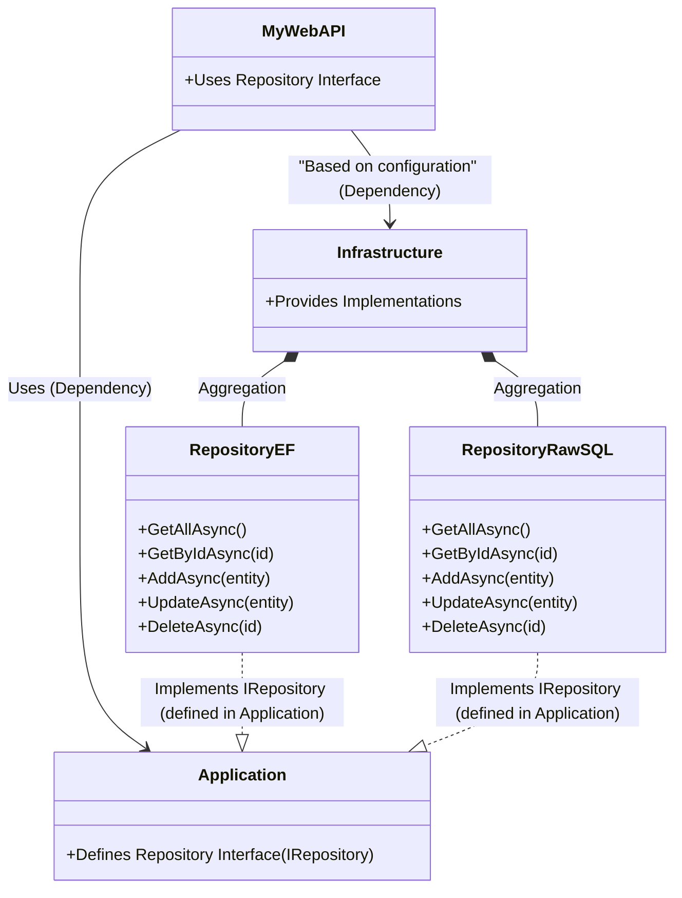

Below is an updated guide that uses Visual Studio’s UI (instead of CLI commands) to create an empty solution and projects, then build a .NET Web API using SQLite and the IRepository pattern with two implementations (EF Core and raw SQL). At the end, you’ll see a Mermaid diagram summarizing the architecture.

---

## **Step 0: Create an Empty Solution in Visual Studio**

1. **Open Visual Studio** (2022 or later).  
2. **Create a new project**:  
   - Go to **File > New > Project**.  
   - Select the **"Blank Solution"** template.  
   - Name the solution **MySolution** and choose your location.  
3. Click **Create**.

---

## **Step 1: Create the Projects**

### **1. Create the Web API Project (MyWebAPI)**

1. In **Solution Explorer**, right-click the solution and choose **Add > New Project**.
2. Select the **"ASP.NET Core Web API"** template.
3. Name the project **MyWebAPI**.
4. Configure the project (e.g., target .NET 6/7/9) and click **Create**.
5. If the template uses minimal APIs (top-level statements), you can modify it later to use controllers:
   - In **Program.cs**, remove any minimal endpoint mappings (like `app.MapGet(...)`) and add:
     ```csharp
     builder.Services.AddControllers();
     // ...
     app.MapControllers();
     ```
   - Add a new folder **Controllers** and create your controller classes there.

### **2. Create the Application Class Library**

1. Right-click the solution and choose **Add > New Project**.
2. Select the **"Class Library"** template.
3. Name the project **Application**.
4. Click **Create**.

### **3. Create the Infrastructure Class Library**

1. Right-click the solution and choose **Add > New Project**.
2. Select the **"Class Library"** template.
3. Name the project **Infrastructure**.
4. Click **Create**.

### **4. Set Up Project References**

1. In **Solution Explorer**, right-click the **MyWebAPI** project and choose **Add > Reference...**.
2. Check both **Application** and **Infrastructure** projects, then click **OK**.
3. In the **Infrastructure** project, add a reference to **Application** by right-clicking **Infrastructure**, choosing **Add > Reference...**, and selecting **Application**.

---

## **Step 2: Install Required NuGet Packages**

Use the **NuGet Package Manager** in Visual Studio:

1. In **Solution Explorer**, right-click the **MyWebAPI** project and choose **Manage NuGet Packages**.
2. Install the following packages:
   - **Microsoft.EntityFrameworkCore**
   - **Microsoft.EntityFrameworkCore.Sqlite**
   - **Microsoft.EntityFrameworkCore.Design**
   - **Microsoft.EntityFrameworkCore.Tools**
3. (The raw SQL implementation will use ADO.NET with the **Microsoft.Data.Sqlite** package, which comes with the EF SQLite package.)

---

## **Step 3: Configure SQLite**

### **3.1 Create the Database Context (EF Implementation)**

1. In the **Infrastructure** project, create a new folder called **Data**.
2. Add a new class named **ApplicationDbContext.cs** with the following code:

   ```csharp
   using Microsoft.EntityFrameworkCore;

   namespace Infrastructure.Data
   {
       public class ApplicationDbContext : DbContext
       {
           public ApplicationDbContext(DbContextOptions<ApplicationDbContext> options)
               : base(options) { }

           public DbSet<Product> Products { get; set; }
       }

       // A simple Product entity
       public class Product
       {
           public int Id { get; set; }
           public string Name { get; set; } = string.Empty;
           public decimal Price { get; set; }
       }
   }
   ```

---

## **Step 4: Define the Repository Interface**

1. In the **Application** project, create a new folder called **Interfaces**.
2. Add a new class named **IRepository.cs** with the following code:

   ```csharp
   using System.Collections.Generic;
   using System.Threading.Tasks;

   namespace Application.Interfaces
   {
       public interface IRepository<T> where T : class
       {
           Task<IEnumerable<T>> GetAllAsync();
           Task<T?> GetByIdAsync(int id);
           Task AddAsync(T entity);
           Task UpdateAsync(T entity);
           Task DeleteAsync(int id);
       }
   }
   ```

---

## **Step 5: Implement the Entity Framework Repository**

1. In the **Infrastructure** project, create a new folder called **Repositories**.
2. Add a new class named **RepositoryEF.cs** with the following code:

   ```csharp
   using Application.Interfaces;
   using Infrastructure.Data;
   using Microsoft.EntityFrameworkCore;

   namespace Infrastructure.Repositories
   {
       public class RepositoryEF<T> : IRepository<T> where T : class
       {
           private readonly ApplicationDbContext _context;
           private readonly DbSet<T> _dbSet;

           public RepositoryEF(ApplicationDbContext context)
           {
               _context = context;
               _dbSet = _context.Set<T>();
           }

           public async Task<IEnumerable<T>> GetAllAsync()
           {
               return await _dbSet.ToListAsync();
           }

           public async Task<T?> GetByIdAsync(int id)
           {
               return await _dbSet.FindAsync(id);
           }

           public async Task AddAsync(T entity)
           {
               await _dbSet.AddAsync(entity);
               await _context.SaveChangesAsync();
           }

           public async Task UpdateAsync(T entity)
           {
               _dbSet.Update(entity);
               await _context.SaveChangesAsync();
           }

           public async Task DeleteAsync(int id)
           {
               var entity = await _dbSet.FindAsync(id);
               if (entity != null)
               {
                   _dbSet.Remove(entity);
                   await _context.SaveChangesAsync();
               }
           }
       }
   }
   ```

---

## **Step 6: Implement the Raw SQL Repository (No DbContext)**

1. In the **Infrastructure/Repositories** folder, add a new class named **RepositoryRawSQL.cs** with the following code:

   ```csharp
   using Application.Interfaces;
   using Microsoft.Data.Sqlite;
   using System;
   using System.Collections.Generic;
   using System.Linq;
   using System.Text.Json;
   using System.Threading.Tasks;

   namespace Infrastructure.Repositories
   {
       public class RepositoryRawSQL<T> : IRepository<T> where T : class
       {
           private readonly string _connectionString;

           public RepositoryRawSQL(string connectionString)
           {
               _connectionString = connectionString;
           }

           private SqliteConnection GetConnection()
           {
               return new SqliteConnection(_connectionString);
           }

           private Dictionary<string, object?> ReadRow(SqliteDataReader reader)
           {
               var dict = new Dictionary<string, object?>();
               for (int i = 0; i < reader.FieldCount; i++)
               {
                   dict[reader.GetName(i)] = reader.IsDBNull(i) ? null : reader.GetValue(i);
               }
               return dict;
           }

           public async Task<IEnumerable<T>> GetAllAsync()
           {
               var result = new List<T>();
               using var connection = GetConnection();
               await connection.OpenAsync();
               var tableName = typeof(T).Name + "s"; // basic pluralization
               var command = new SqliteCommand($"SELECT * FROM {tableName}", connection);
               using var reader = await command.ExecuteReaderAsync();
               while (await reader.ReadAsync())
               {
                   var rowDict = ReadRow(reader);
                   var json = JsonSerializer.Serialize(rowDict);
                   var entity = JsonSerializer.Deserialize<T>(json);
                   if (entity != null)
                       result.Add(entity);
               }
               return result;
           }

           public async Task<T?> GetByIdAsync(int id)
           {
               using var connection = GetConnection();
               await connection.OpenAsync();
               var tableName = typeof(T).Name + "s";
               var command = new SqliteCommand($"SELECT * FROM {tableName} WHERE Id = @id", connection);
               command.Parameters.AddWithValue("@id", id);
               using var reader = await command.ExecuteReaderAsync();
               if (await reader.ReadAsync())
               {
                   var rowDict = ReadRow(reader);
                   var json = JsonSerializer.Serialize(rowDict);
                   return JsonSerializer.Deserialize<T>(json);
               }
               return null;
           }

           public async Task AddAsync(T entity)
           {
               using var connection = GetConnection();
               await connection.OpenAsync();
               var tableName = typeof(T).Name + "s";

               var props = typeof(T).GetProperties().Where(p => p.Name != "Id").ToList();
               var columns = string.Join(", ", props.Select(p => p.Name));
               var parameters = string.Join(", ", props.Select(p => "@" + p.Name));

               var command = new SqliteCommand($"INSERT INTO {tableName} ({columns}) VALUES ({parameters})", connection);
               foreach (var prop in props)
               {
                   command.Parameters.AddWithValue("@" + prop.Name, prop.GetValue(entity) ?? DBNull.Value);
               }
               await command.ExecuteNonQueryAsync();
           }

           public async Task UpdateAsync(T entity)
           {
               using var connection = GetConnection();
               await connection.OpenAsync();
               var tableName = typeof(T).Name + "s";
               var idProp = typeof(T).GetProperty("Id");
               if (idProp == null)
                   throw new Exception("Entity must have an Id property.");

               var idValue = idProp.GetValue(entity);
               if (idValue == null)
                   throw new Exception("Id value cannot be null.");

               var props = typeof(T).GetProperties().Where(p => p.Name != "Id").ToList();
               var setClause = string.Join(", ", props.Select(p => $"{p.Name} = @{p.Name}"));

               var command = new SqliteCommand($"UPDATE {tableName} SET {setClause} WHERE Id = @Id", connection);
               command.Parameters.AddWithValue("@Id", idValue);
               foreach (var prop in props)
               {
                   command.Parameters.AddWithValue("@" + prop.Name, prop.GetValue(entity) ?? DBNull.Value);
               }
               await command.ExecuteNonQueryAsync();
           }

           public async Task DeleteAsync(int id)
           {
               using var connection = GetConnection();
               await connection.OpenAsync();
               var tableName = typeof(T).Name + "s";
               var command = new SqliteCommand($"DELETE FROM {tableName} WHERE Id = @id", connection);
               command.Parameters.AddWithValue("@id", id);
               await command.ExecuteNonQueryAsync();
           }
       }
   }
   ```

*Note: This implementation assumes table names are the plural of the entity names (e.g., Product → Products).*

---

## **Step 7: Configure Application Settings**

1. In **MyWebAPI**, open the **appsettings.json** file.
2. Update it with the following content:

   ```json
   {
     "ConnectionStrings": {
       "DefaultConnection": "Data Source=mydatabase.db"
     },
     "UseRawSQL": true,
     "Logging": {
       "LogLevel": {
         "Default": "Information",
         "Microsoft.AspNetCore": "Warning"
       }
     },
     "AllowedHosts": "*"
   }
   ```

*Set `"UseRawSQL"` to `true` for the raw SQL implementation, or `false` to use the EF Core implementation.*

---

## **Step 8: Configure Dependency Injection in MyWebAPI**

1. In **MyWebAPI**, open the **Program.cs** file.
2. Modify it as follows:

   ```csharp
   using Application.Interfaces;
   using Infrastructure.Data;
   using Infrastructure.Repositories;
   using Microsoft.EntityFrameworkCore;

   var builder = WebApplication.CreateBuilder(args);

   // Retrieve connection string and flag from configuration
   var connectionString = builder.Configuration.GetConnectionString("DefaultConnection");
   bool useRawSQL = builder.Configuration.GetValue<bool>("UseRawSQL");

   if (!useRawSQL)
   {
       // Register EF DbContext when not using raw SQL
       builder.Services.AddDbContext<ApplicationDbContext>(options =>
           options.UseSqlite(connectionString));
   }

   // Register repository based on configuration flag
   if (useRawSQL)
   {
       // For raw SQL, pass the connection string directly
       builder.Services.AddScoped(typeof(IRepository<>), provider =>
           new RepositoryRawSQL<>(connectionString));
   }
   else
   {
       builder.Services.AddScoped(typeof(IRepository<>), typeof(RepositoryEF<>));
   }

   builder.Services.AddControllers();
   builder.Services.AddEndpointsApiExplorer();
   builder.Services.AddSwaggerGen();

   var app = builder.Build();

   if (app.Environment.IsDevelopment())
   {
       app.UseSwagger();
       app.UseSwaggerUI();
   }

   app.UseAuthorization();
   app.MapControllers();
   app.Run();
   ```

---

## **Step 9: Create a Sample Controller**

1. In **MyWebAPI**, create a new folder named **Controllers**.
2. Add a new controller class called **ProductController.cs** with the following code:

   ```csharp
   using Application.Interfaces;
   using Infrastructure.Data; // Only to access the Product model
   using Microsoft.AspNetCore.Mvc;

   namespace MyWebAPI.Controllers
   {
       [Route("api/[controller]")]
       [ApiController]
       public class ProductController : ControllerBase
       {
           private readonly IRepository<Product> _repository;

           public ProductController(IRepository<Product> repository)
           {
               _repository = repository;
           }

           [HttpGet]
           public async Task<IActionResult> GetAll()
           {
               var products = await _repository.GetAllAsync();
               return Ok(products);
           }

           [HttpGet("{id}")]
           public async Task<IActionResult> GetById(int id)
           {
               var product = await _repository.GetByIdAsync(id);
               if (product == null)
                   return NotFound();
               return Ok(product);
           }

           [HttpPost]
           public async Task<IActionResult> Create(Product product)
           {
               await _repository.AddAsync(product);
               return CreatedAtAction(nameof(GetById), new { id = product.Id }, product);
           }

           [HttpPut("{id}")]
           public async Task<IActionResult> Update(int id, Product product)
           {
               if (id != product.Id)
                   return BadRequest("Mismatched product ID.");
               await _repository.UpdateAsync(product);
               return NoContent();
           }

           [HttpDelete("{id}")]
           public async Task<IActionResult> Delete(int id)
           {
               var existing = await _repository.GetByIdAsync(id);
               if (existing == null)
                   return NotFound();
               await _repository.DeleteAsync(id);
               return NoContent();
           }
       }
   }
   ```

---

## **Step 10: Run and Test the API**

1. Press **F5** or click **Start Debugging** in Visual Studio to run the project.
2. Open your browser and navigate to the URL provided (for example, `https://localhost:5001/swagger`) to test the endpoints.

---

## **Summary**

- **Solution Setup:**  
  You created an empty solution in Visual Studio and added three projects:
  - **MyWebAPI:** The API layer.
  - **Application:** Contains business logic and interfaces.
  - **Infrastructure:** Contains data access implementations (RepositoryEF and RepositoryRawSQL).

- **Data Access Implementations:**  
  - **RepositoryEF:** Uses EF Core with a DbContext.
  - **RepositoryRawSQL:** Uses pure ADO.NET with SQLite (no DbContext).

- **Configuration Toggle:**  
  In **appsettings.json**, `"UseRawSQL"` determines which repository implementation is used.

- **Dependency Injection:**  
  MyWebAPI registers dependencies based on configuration, and controllers use the repository interface defined in the Application layer.

---

## **Architecture Overview (Mermaid Diagram)**

Below is a Mermaid diagram summarizing the project/class-level dependencies and associations, with a note that MyWebAPI calls Infrastructure based on configuration:



### **Diagram Explanation:**

- **MyWebAPI (Presentation Layer):**  
  Uses the repository interface defined in **Application** and calls into **Infrastructure** based on configuration.

- **Application (Business Layer):**  
  Defines the repository interface (IRepository) that both repository implementations follow.

- **Infrastructure (Data Access Layer):**  
  Provides two implementations:
  - **RepositoryEF:** Uses EF Core/SQLite.
  - **RepositoryRawSQL:** Uses raw SQL (ADO.NET).  
  Both are aggregated within Infrastructure and implement the interface defined in Application.

This diagram and guide together provide a clear overview of how the solution is structured using Visual Studio, without CLI commands, and how configuration determines the concrete repository implementation.
